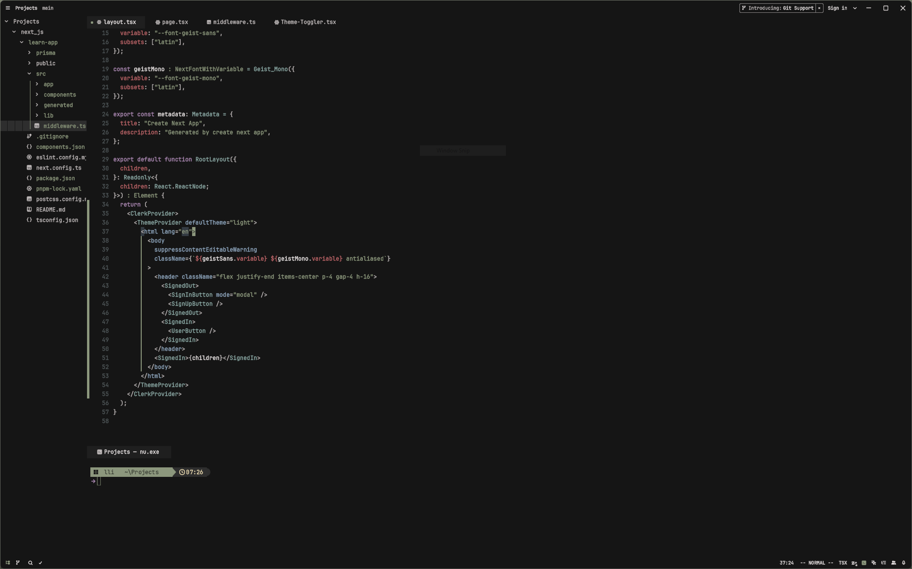

# Paradise theme for Zed

Paradise port for [Zed](https://zed.dev) (community)

**This theme is available for other applications [here](https://github.com/paradise-theme/paradise)**

## Screenshots

## Manual installation

1. Copy `themes/paradise.json` to `~/.config/zed/themes/`
2. Select your theme (`Ctrl+K Ctrl+T` or use Settings -> Select Theme or Copy settings.json to your config)
